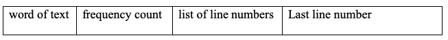

# Instructions  

 A common problem in textual analysis is to determine the frequency and location of words in a document. The information is stored in a concordance, which lists the distinct words in alphabetical order and makes references to each line on which the word is used. For instance, consider the quotation:
 ```
Peter Piper picked a peck of pickled peppers. A peck of pickled
peppers Peter Piper picked. If Peter Piper picked a peck of
 pickled peppers, where is the peck that Peter Piper picked?
 ```
The word “piper” occurs 4 times in the text and appears on lines 1, 2, and 3. The word “pickled” occurs 3 times and appears on lines 1 and 2.

For the text above, the output of the concordance is:


Write a program to create a concordance for a text file. Since during the process of building the concordance, it is frequently necessary to look up the word in the current words in the concordance, update concordance entries, as well as insert new words into the concordance, a binary search tree data structure is a good candidate for the application. 
A word is a consecutive sequence of letters of the alphabet.  Your concordance should not be case sensitive (i.e. Pickled and pickled are the same words). Your program should input the text word by word, keeping track of the current line (line 1, line 2, etc.). Extract each word and insert it into a binary search tree. Each node of the tree should have the form:

The node should also have a method that returns the key value for the data. The key of data in this application is the word. All the words are arranged in the binary search tree based on the alphabetical order of the words:
1. If the word is encountered the first time, a new data is created. The data includes the word, frequency count of 1, the line number in the list of line numbers, and the line number as the “last line number” see so far. Inserted the new data into the tree.
2.	If the word is already in the tree, update the frequency and line number list. After reading the file, print an alphabetized list of words, the frequency count, and the ordered list of lines on which the word occurred. 

Program Requirements:
* A node struct is defined with the required data members and key function
* Use STL list for the list of lines.  
* Write a binary search tree class for organizing and storing the words 
* Develop user defined functions in the main(client) program to support modularity
